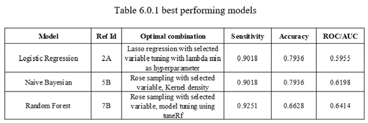

# MachineLearning
Data Science and Machine Learning

# Project Title
Prediction of used-car quality using machine learning (in R).

The current project aims to perform the prediction of used cars quality by using machine learning. As this field of research has only starting to gain attention, the reluctance of most car vendors to reveal their research findings may have indirectly contributed to the lack of literature on this regard. However, the rapid expansion of the used car industry may lead to an influx of number of used cars to be evaluated by the used car dealers. Consequently, the increased number of vehicles in varying conditions and types may overwhelm the dealers’ ability to correctly discern the vehicle quality. Machine learning has been proposed as a viable solution as the judgment of the vehicle quality can be automated by analysing the vehicle attributes. The findings of the current project revealed that machine learning may be the suitable solution to predict vehicle quality. Particularly, most models were able to detect large portion of the bad buy (vehicle that suffer from irreparable damage). 

## The best performing model from naive bayes, logistic regression and random forest

### Highlight for LOGISTIC REGRESSION
	Based on the results above, the logistic regression model built by using Lasso regression and selected features showed a fairly good performance in terms of sensitivity and accuracy. In this case, the logistic regression model has managed to detect almost 90% of the positive values within the dataset. Furthermore, of all the predictions made by the model, around 79% of the predictions were correct, as shown from the accuracy. Additionally, the model AUC is approximately 59%, but it may matter less to the issue of the current project. 
  As discussed before, the higher sensitivity of the models may contribute to the conservativeness of the model. In other words, more cars may be classified as a bad buy although they may not necessarily be actual bad buy. Even though this may lack in accuracy and potentially contributed to the lower model AUC, this may benefit the car dealers by only selecting cars that are in good condition thereby lowering the risk of committing a bad buy. 
  In addition to the business implications above, the algorithm may be further improved by adjusting other hyperparameters. In the current project, only ridge and lasso regression were performed as means of model regularization. Nonetheless, the model regularization can be further customized by adjusting the strength of the regularization, which is denoted as C. In simpler terms, higher C value indicates higher regularization and vice versa. In order to discover the optimal parameter C, methods such as grid search or random search may be employed. 
